# C++ Systematic Strategy Evaluation and Robustness Platform

A modular C++17 platform for causal backtesting, shared-cash portfolio simulation, calendar-aware out-of-sample evaluation, benchmark-relative analysis, trade-aware attribution, and dependence-preserving statistical inference.

The system supports reproducible strategy and allocation-policy experiments on daily OHLCV data. It separates simulation from export, records methodological assumptions in schema-versioned outputs, and uses Python only for data acquisition, independent validation, visualization, and reporting.

Development is AI-assisted and remains directed, reviewed, and maintained by Mrithunjoy Basumatary. AI systems are not project authors or copyright holders.

## Research Scope

Historical strategy evaluation is vulnerable to timing errors, optimistic execution assumptions, benchmark mismatches, calendar misalignment, accounting omissions, and selection bias. This repository addresses those problems through causal signal-to-fill timing, explicit costs, calendar-duration walk-forward tests, continuous out-of-sample capital, benchmark execution parity, and validated portfolio accounting.

The portfolio research path additionally handles mixed equity and cryptocurrency calendars, concentration and attribution analysis, corporate actions, and uncertainty estimates that preserve short-range return dependence. Strategy research retains exact candidate-level OOS diagnostics and applies family-wise and cross-family selection-risk correction on strict common-date panels.

## Capabilities

| Area | Capabilities |
| --- | --- |
| Simulation | Event-driven market -> signal -> order -> fill -> portfolio flow; next-open execution; commission and slippage; long-only accounting; single-asset and shared-cash multi-asset simulation; deterministic cash-constrained fills; benchmark execution parity |
| Strategies | Moving Average Crossover, RSI Mean Reversion, MACD Momentum, Volatility Breakout |
| Portfolio Research | Equal Weight, Inverse Volatility, Momentum Top-N; union-calendar valuation; mixed equity/BTC calendars; civil weekly and monthly rebalancing; deferred, skipped, and partial rebalance policies |
| Validation Methodology | Calendar-duration walk-forward windows; continuous OOS capital; boundary liquidation with costs; causal regimes; same-asset and external benchmarks; parameter grids; transaction-cost sensitivity |
| Corporate Actions | Raw-price, split-adjusted, and total-return-adjusted policies; stock and reverse splits; cash dividends; dividend double-count prevention |
| Attribution | Trade-aware asset, cash, cost, corporate-action, rebalance, benchmark-relative, drawdown, volatility, regime, and calendar-year attribution; exact reconciliation with residual rejection |
| Statistical Inference | Circular moving-block bootstrap by default; IID comparison mode; empirical confidence intervals; centered max-mean reality checks over MA, RSI, MACD, Volatility Breakout, and combined candidate grids; parameter stability and neighbourhood diagnostics |
| Engineering | Reusable `quant_core` C++17 library; thin `quant_cli`; typed JSON configuration; versioned reproducibility manifests; hash-verified inputs and outputs; deterministic bounded candidate execution; immutable per-run data reuse; deterministic C++/Python tests; strict warnings; Linux/macOS CI; ASan, UBSan, and TSan |

## Methodological Design

- **Timing:** indicators and decisions use information available through a bar close; resulting orders execute at the next eligible open. Valuation follows execution and portfolio-state updates.
- **Causality:** regime labels and allocation inputs use only information available before the decision cutoff. Walk-forward training and test periods are separated by calendar boundaries.
- **Out-of-sample continuity:** test windows use calendar durations, preserve capital between consecutive OOS windows, and apply configured costs to boundary liquidations.
- **Execution and benchmarks:** commissions, slippage, affordability, and long-only constraints are explicit. Strategy and benchmark comparisons use documented execution and cost policies.
- **Mixed calendars:** shared portfolios are valued on the union calendar. Tradability is distinct from valuation; closed assets use last-known marks subject to a configured stale-mark limit. Annualization conventions are recorded according to each experiment and valuation calendar.
- **Corporate actions:** configured adjustment policies govern split quantity/basis changes and dividend cash flows while preventing duplicate dividend recognition.
- **Attribution:** portfolio P&L is reconciled to market, cash, transaction-cost, and corporate-action components. Material residuals fail validation.
- **Inference:** the default circular moving-block bootstrap preserves local serial dependence within resampled blocks. Deterministic IID resampling is retained only as a comparison mode.

Detailed definitions and assumptions are in [Methodology](docs/METHODOLOGY.md), [Market Calendar](docs/MARKET_CALENDAR.md), [Corporate Actions](docs/CORPORATE_ACTIONS.md), [Attribution](docs/ATTRIBUTION.md), and [Statistical Methodology](docs/STATISTICAL_METHODOLOGY.md).

## Architecture

```mermaid
flowchart LR
    CLI[quant_cli] --> APP[Application Layer]
    APP --> CORE[quant_core]

    CORE --> DATA[Market Data]
    DATA --> STRAT[Strategies / Allocation]
    STRAT --> ORDERS[Orders]
    ORDERS --> EXEC[Execution]
    EXEC --> PORT[Portfolio State]
    PORT --> ANALYTICS[Analytics]
    ANALYTICS --> ATTR[Attribution]
    ATTR --> STATS[Statistical Inference]
    STATS --> IO[Export and Reporting]
```



`quant_cli` parses commands and delegates to the application layer. Application orchestration resolves typed configuration and invokes `quant_core`, whose simulation, experiment, analytics, attribution, statistical, and IO modules remain separately testable. Export is outside the simulation path. Python scripts independently validate selected calculations and produce figures and Markdown reports from exported data.

See [Architecture](docs/ARCHITECTURE.md) and [Data Model](docs/DATA_MODEL.md) for module and domain boundaries.

## Research Workflow

1. Acquire and validate historical data.
2. Resolve and validate a typed experiment configuration.
3. Run a single-asset or shared-cash portfolio experiment.
4. Perform calendar-duration walk-forward evaluation where configured.
5. Generate benchmark-relative analytics.
6. Reconcile portfolio attribution.
7. Run dependence-preserving statistical inference.
8. Validate schema, accounting identities, and statistical outputs.
9. Generate figures and reports.

```bash
python3 scripts/download_data.py
./build/quant_cli validate-config --config configs/portfolio_equal_weight.json
./build/quant_cli run --config configs/portfolio_equal_weight.json
./build/quant_cli run --config configs/selection_risk_all.json --execution-mode parallel --threads 4
python3 scripts/validate_results.py results
python3 scripts/visualize_results.py
```

Reconstruct the complete canonical research suite, including validators and reports, with:

```bash
python3 scripts/reproduce.py --manifest manifests/canonical_research_suite.json \
  --output-directory results/reproduced/canonical-suite --allow-compatible-environment
```

## Verified Research Findings

The checked schema-v3 equal-weight portfolio output reports a **536.94%** historical return and **425.47%** active return versus SPY. BTC-USD contributed approximately **33.46%** and TSLA **31.48%** of net profit; together they account for approximately **64.94%**, indicating material concentration. The worst drawdown was approximately **-48.77%**, with BTC-USD the dominant negative contributor during that episode.

Using 1,000 circular moving-block bootstrap simulations over 2,190 return observations:

| Allocation policy | Sharpe 95% confidence interval | Probability Sharpe exceeds benchmark |
| --- | ---: | ---: |
| Equal Weight | 0.351 to 1.932 | 94.9% |
| Inverse Volatility | 0.362 to 2.030 | 97.9% |
| Momentum Top-N | -0.145 to 1.381 | 35.2% |

Inverse Volatility currently has the strongest statistical evidence, while Equal Weight also shows comparatively strong evidence. Momentum Top-N remains inconclusive. These are historical findings, not forecasts; portfolio performance is materially concentrated in BTC-USD and TSLA.

Stochastic methodology version 2 uses a repository-owned unbiased bounded mapping with `mt19937`. The regenerated combined TSLA MACD adjusted p-value is approximately `0.0559` at base costs, `0.0509` at zero cost, and `0.0729` at high cost; all remain above 0.05. Regime slices remain exploratory. See [RNG Methodology](docs/RNG_METHODOLOGY.md) and [Final Audit](docs/FINAL_AUDIT.md).

Full generated reports are written locally to `results/research_v3/portfolio_equal_weight/attribution/attribution_report.md`, `results/research_v3/portfolio_equal_weight/statistics/statistical_report.md`, and `results/research_v3/selection_risk/all_families/selection_risk/selection_risk_report.md`. Generated research artifacts are intentionally not tracked.

## Build

```bash
cmake -S . -B build -DCMAKE_BUILD_TYPE=Release
cmake --build build --parallel
ctest --test-dir build --output-on-failure
```

## CLI and Configuration

```bash
./build/quant_cli run --config configs/portfolio_equal_weight.json
./build/quant_cli validate-config --config configs/portfolio_equal_weight.json
./build/quant_cli print-resolved-config --config configs/portfolio_equal_weight.json
./build/quant_cli list-strategies
./build/quant_cli list-allocation-policies
./build/quant_cli --help
./build/quant_cli --version
```

JSON configurations define the data universe, strategy or allocation policy, capital, costs, calendar behavior, benchmark, experiment parameters, and execution controls. Parallelism is limited to independent selection-risk candidate simulations; serial mode remains the reference. See [Configuration](docs/CONFIGURATION.md). Legacy `--mode` commands remain available for compatibility but are not the preferred research interface.

On the measured Apple M1 Release workload, immutable data and benchmark reuse reduced the complete seven-package selection-risk median from 109.06 s to 22.05 s (4.95x). Four threads reduced the optimized median to 14.45 s (1.53x over optimized serial). Component-level thread scaling was noisy, so these are machine-specific end-to-end results rather than a universal thread-count recommendation. See [Performance](docs/PERFORMANCE.md).

## Validation

The current tree has 23 CTest targets covering deterministic regression, domain/configuration, methodology, export, bootstrap, stable RNG vectors, calendar, corporate actions, union-calendar portfolios, attribution, statistics, candidate selection risk, performance/concurrency, reproducibility, final-audit gates, and CLI behavior. The regression snapshot check matches 8/8 tracked scenarios.

Validation also includes strict compiler warnings, ASan, UBSan, TSan, Linux and macOS Release CI, schema/result validation, dedicated attribution and statistical corruption tests, parallel package equivalence, and Python reference cross-checks. See [Testing](docs/TESTING.md) for commands and test boundaries.

## Outputs

Results are grouped into single-asset backtests, calendar walk-forward research, schema-v3 shared-portfolio outputs, reconciled attribution, statistical inference, figures, and Markdown reports. Schema-v3 is the current portfolio research schema. Schema-v1 and schema-v2 files are retained only as explicitly labelled legacy or regression-compatibility artifacts.

See [Result Schema](docs/RESULT_SCHEMA.md) for output filenames, columns, units, and metadata.

## Reproducibility

Reproducibility mechanisms include versioned manifests, hash-verified tracked inputs, resolved configurations, deterministic seeds, a repository-owned stable bounded sampler, schema/build/dependency provenance, atomic reconstruction, regression snapshots, Python references, and CI. Release-candidate manifests use exact implementation identity and zero-tolerance semantic comparison for stochastic numerical artifacts.

## Documentation

- [Architecture](docs/ARCHITECTURE.md)
- [Configuration](docs/CONFIGURATION.md)
- [Data Model](docs/DATA_MODEL.md)
- [Market Calendar](docs/MARKET_CALENDAR.md)
- [Corporate Actions](docs/CORPORATE_ACTIONS.md)
- [Methodology](docs/METHODOLOGY.md)
- [Attribution](docs/ATTRIBUTION.md)
- [Statistical Methodology](docs/STATISTICAL_METHODOLOGY.md)
- [Result Schema](docs/RESULT_SCHEMA.md)
- [Testing](docs/TESTING.md)
- [Performance](docs/PERFORMANCE.md)
- [Reproducibility](docs/REPRODUCIBILITY.md)
- [RNG Methodology](docs/RNG_METHODOLOGY.md)
- [Final Audit](docs/FINAL_AUDIT.md)

## Limitations

- The simulation uses daily bars and is long-only by default; it does not model order books, ticks, intraday queues, taxes, financing, borrow costs, or withholding taxes.
- Exchange closures are inferred from data availability because authoritative exchange calendars are not yet integrated.
- Payable-date settlement, delistings, symbol changes, and cash-in-lieu processing are incomplete.
- Downloaded market data may not contain complete dividend, split, or other corporate-action provenance.
- Candidate histories are normalized counterfactual OOS diagnostics, not deployable continuous-capital paths; selected-strategy continuous capital remains separate.
- Reality-check evidence is conditional on eligibility and strict common-date intersection. Regime-conditioned tests are exploratory because they are not additionally corrected across regime slices.
- Portfolio-policy reality-check outputs remain one-policy diagnostics and are distinct from the strategy-grid correction.
- Attribution is a historical accounting decomposition, not a claim of economic causality.
- Statistical evidence from historical samples does not imply future profitability.

## Development Roadmap

### Near-Term Roadmap

1. Complete final release acceptance checks and curate release artifacts.
2. Hash-pin Python validation distributions and reviewed GitHub Actions revisions.
3. Produce final release notes without changing migrated methodology.
4. Prepare `v1.0.0` only after final CI and reconstruction remain green.

### Longer-Term Extensions

Possible future directions, not current capabilities or committed deliverables:

- Intraday event simulation using appropriately granular data
- Richer execution, liquidity, and partial-fill models
- Derivatives and options backtesting
- Machine-learning strategy adapters
- Live paper-trading integration
- Exchange-native calendar and corporate-action providers

## License and Data Terms

The project source code, documentation, configuration, and original test fixtures are licensed under the [Apache License 2.0](LICENSE). Copyright 2026 Mrithunjoy Basumatary. See [NOTICE](NOTICE) for attribution and scope.

The historical market-data CSVs in `data/` are third-party data acquired from Yahoo Finance through yfinance. They are excluded from the Apache-2.0 grant and remain subject to applicable upstream terms; this repository does not grant rights to redistribute or commercially use them. Users should supply market data they are independently entitled to use. The tracked files currently support exact research reconstruction, but their upstream provenance is incomplete and their public redistribution status is an unresolved `v1.0.0` release gate.

## Disclaimer

This repository is a research and engineering system. Its historical results are not investment advice and do not imply future profitability.
