# C++ Systematic Strategy Evaluation and Robustness Platform

A modular C++17 platform for causal backtesting, shared-cash portfolio simulation, calendar-aware out-of-sample evaluation, benchmark-relative analysis, trade-aware attribution, and dependence-preserving statistical inference.

The system supports reproducible strategy and allocation-policy experiments on daily OHLCV data. Public reconstruction uses independently generated synthetic fixtures; empirical research uses local, user-supplied data that is never part of the public canonical suite. Simulation is separated from export, and Python is used for fixture generation, optional acquisition, independent validation, visualization, and reporting.

Development is AI-assisted and remains directed, reviewed, and maintained by Mrithunjoy Basumatary. AI systems are not project authors or copyright holders.

The executable version is `1.0.0`. The annotated `v1.0.0` tag and corresponding GitHub Release, when present, are the authoritative immutable release identity; branch state is not a substitute for a release tag.

## Research Scope

Historical strategy evaluation is vulnerable to timing errors, optimistic execution assumptions, benchmark mismatches, calendar misalignment, accounting omissions, and selection bias. This repository addresses those problems through causal signal-to-fill timing, explicit costs, calendar-duration walk-forward tests, continuous out-of-sample capital, benchmark execution parity, and validated portfolio accounting.

The portfolio research path additionally handles mixed equity and cryptocurrency calendars, concentration and attribution analysis, corporate actions, and uncertainty estimates that preserve short-range return dependence. Strategy research retains exact candidate-level OOS diagnostics and applies family-wise and cross-family selection-risk correction on strict common-date panels.

## Capabilities

| Area | Capabilities |
| --- | --- |
| Simulation | Event-driven market -> signal -> order -> fill -> portfolio flow; next-open execution; commission and slippage; long-only accounting; single-asset and shared-cash multi-asset simulation; deterministic cash-constrained fills; benchmark execution parity |
| Strategies | Moving Average Crossover, RSI Mean Reversion, MACD Momentum, Volatility Breakout |
| Portfolio Research | Equal Weight, Inverse Volatility, Momentum Top-N; union-calendar valuation; mixed equity/BTC calendars; civil weekly and monthly rebalancing; deferred, skipped, and partial rebalance policies |
| Validation Methodology | Calendar-duration walk-forward windows; continuous OOS capital; boundary liquidation with costs; causal regimes; same-asset and external benchmarks; parameter grids; transaction-cost sensitivity |
| Corporate Actions | Raw-price, split-adjusted, and total-return-adjusted policies; stock and reverse splits; cash dividends; dividend double-count prevention |
| Attribution | Trade-aware asset, cash, cost, corporate-action, rebalance, benchmark-relative, drawdown, volatility, regime, and calendar-year attribution; exact reconciliation with residual rejection |
| Statistical Inference | Circular moving-block bootstrap by default; IID comparison mode; empirical confidence intervals; centered max-mean reality checks over MA, RSI, MACD, Volatility Breakout, and combined candidate grids; parameter stability and neighbourhood diagnostics |
| Engineering | Reusable `quant_core` C++17 library; thin `quant_cli`; typed JSON configuration; versioned reproducibility manifests; hash-verified inputs and outputs; deterministic bounded candidate execution; immutable per-run data reuse; deterministic C++/Python tests; strict warnings; Linux/macOS CI; ASan, UBSan, and TSan |
| Data Boundary | Five deterministic synthetic assets; offline byte-for-byte generation; provider-neutral user-data validation; local SHA-256 manifests; tracked-data and sampled-row exclusion gate |

## Methodological Design

- **Timing:** indicators and decisions use information available through a bar close; resulting orders execute at the next eligible open. Valuation follows execution and portfolio-state updates.
- **Causality:** regime labels and allocation inputs use only information available before the decision cutoff. Walk-forward training and test periods are separated by calendar boundaries.
- **Out-of-sample continuity:** test windows use calendar durations, preserve capital between consecutive OOS windows, and apply configured costs to boundary liquidations.
- **Execution and benchmarks:** commissions, slippage, affordability, and long-only constraints are explicit. Strategy and benchmark comparisons use documented execution and cost policies.
- **Mixed calendars:** shared portfolios are valued on the union calendar. Tradability is distinct from valuation; closed assets use last-known marks subject to a configured stale-mark limit. Annualization conventions are recorded according to each experiment and valuation calendar.
- **Corporate actions:** configured adjustment policies govern split quantity/basis changes and dividend cash flows while preventing duplicate dividend recognition.
- **Attribution:** portfolio P&L is reconciled to market, cash, transaction-cost, and corporate-action components. Material residuals fail validation.
- **Inference:** the default circular moving-block bootstrap preserves local serial dependence within resampled blocks. Deterministic IID resampling is retained only as a comparison mode.

Detailed definitions and assumptions are in [Methodology](docs/METHODOLOGY.md), [Market Calendar](docs/MARKET_CALENDAR.md), [Corporate Actions](docs/CORPORATE_ACTIONS.md), [Attribution](docs/ATTRIBUTION.md), and [Statistical Methodology](docs/STATISTICAL_METHODOLOGY.md).

## Architecture

```mermaid
flowchart LR
    CLI[quant_cli] --> APP[Application Layer]
    APP --> CORE[quant_core]

    CORE --> DATA[Market Data]
    DATA --> STRAT[Strategies / Allocation]
    STRAT --> ORDERS[Orders]
    ORDERS --> EXEC[Execution]
    EXEC --> PORT[Portfolio State]
    PORT --> ANALYTICS[Analytics]
    ANALYTICS --> ATTR[Attribution]
    ATTR --> STATS[Statistical Inference]
    STATS --> IO[Export and Reporting]
```



`quant_cli` parses commands and delegates to the application layer. Application orchestration resolves typed configuration and invokes `quant_core`, whose simulation, experiment, analytics, attribution, statistical, and IO modules remain separately testable. Export is outside the simulation path. Python scripts independently validate selected calculations and produce figures and Markdown reports from exported data.

See [Architecture](docs/ARCHITECTURE.md) and [Data Model](docs/DATA_MODEL.md) for module and domain boundaries.

## Companion Project: QuantForge AI

[QuantForge AI](https://github.com/MrithunjoyB/quantforge-ai) is the separately released governance and evidence-review companion to this numerical research platform. It provides immutable experiment constitutions, validated evidence lineage, claim graphs, tamper-evident audit trails and replay, adversarial review, and deterministic verdict eligibility for quantitative claims. Its independently released governance foundation is available in the [QuantForge AI v0.1.0 release](https://github.com/MrithunjoyB/quantforge-ai/releases/tag/v0.1.0).

The C++ engine remains the numerical execution, accounting, analytics, and reproducibility authority. Direct engine integration is planned work and is not part of the current C++ v1.0.0 or QuantForge AI v0.1.0 release.

## Research Workflow

1. Generate and validate the public synthetic fixtures, or validate lawful user-supplied data locally.
2. Resolve and validate a typed experiment configuration.
3. Run a single-asset or shared-cash portfolio experiment.
4. Perform calendar-duration walk-forward evaluation where configured.
5. Generate benchmark-relative analytics.
6. Reconcile portfolio attribution.
7. Run dependence-preserving statistical inference.
8. Validate schema, accounting identities, and statistical outputs.
9. Generate figures and reports.

```bash
python3 scripts/generate_synthetic_market_data.py
python3 scripts/validate_synthetic_market_data.py --regenerate-check
python3 scripts/validate_public_data_boundary.py
./build/quant_cli validate-config --config configs/portfolio_equal_weight.json
./build/quant_cli run --config configs/portfolio_equal_weight.json
./build/quant_cli run --config configs/selection_risk_all.json --execution-mode parallel --threads 4
python3 scripts/validate_market_data.py data/local/LOCAL.csv
python3 scripts/generate_local_data_manifest.py --tickers LOCAL
```

Reconstruct the complete canonical research suite, including validators and reports, with:

```bash
python3 scripts/reproduce.py --manifest manifests/public_reproducibility_suite.json \
  --output-directory results/reproduced/public-synthetic-suite --allow-compatible-environment
```

## Evidence Boundary

The current public canonical outputs use synthetic data and provide software, accounting, inference, and reproducibility evidence only. Their returns and statistical values are not empirical market findings and must not be interpreted as profitability evidence.

Earlier repository revisions evaluated user-obtained market data. Those historical outputs are not release-canonical: the inputs are not redistributed, and reconstruction requires equivalent lawfully obtained data. Audit summaries remain only for methodological traceability. See [Data Provenance](docs/DATA_PROVENANCE.md) and [Final Audit](docs/FINAL_AUDIT.md).

Stochastic methodology version 2 still uses `mt19937` with the repository-owned `portable_bounded_v1` mapping. Public synthetic reports label their evidence boundary directly and are generated under ignored `results/public_synthetic/` paths.

## Build

```bash
python3 -m pip install --require-hashes -r requirements-validation.lock
cmake -S . -B build -DCMAKE_BUILD_TYPE=Release
cmake --build build --parallel
ctest --test-dir build --output-on-failure
```

## Quick Start

```bash
python3 scripts/generate_synthetic_market_data.py
python3 scripts/validate_synthetic_market_data.py --regenerate-check
./build/quant_cli validate-config --config configs/portfolio_equal_weight.json
./build/quant_cli run --config configs/portfolio_equal_weight.json
python3 scripts/validate_results.py results/public_synthetic/portfolio_equal_weight
```

Generated outputs remain under ignored `results/` paths. Public synthetic returns are software-validation evidence, not empirical market evidence.

## CLI and Configuration

```bash
./build/quant_cli run --config configs/portfolio_equal_weight.json
./build/quant_cli validate-config --config configs/portfolio_equal_weight.json
./build/quant_cli print-resolved-config --config configs/portfolio_equal_weight.json
./build/quant_cli list-strategies
./build/quant_cli list-allocation-policies
./build/quant_cli --help
./build/quant_cli --version
```

JSON configurations define the data universe, strategy or allocation policy, capital, costs, calendar behavior, benchmark, experiment parameters, and execution controls. Parallelism is limited to independent selection-risk candidate simulations; serial mode remains the reference. See [Configuration](docs/CONFIGURATION.md). Legacy `--mode` commands remain available for compatibility but are not the preferred research interface.

On the measured Apple M1 Release workload, immutable data and benchmark reuse reduced the complete seven-package selection-risk median from 109.06 s to 22.05 s (4.95x). Four threads reduced the optimized median to 14.45 s (1.53x over optimized serial). Component-level thread scaling was noisy, so these are machine-specific end-to-end results rather than a universal thread-count recommendation. See [Performance](docs/PERFORMANCE.md).

## Validation

The v1.0.0 tree has 30 CTest targets, including deterministic synthetic generation, user-data validation, public-boundary corruption tests, release provenance closure, version consistency, archive/SBOM corruption tests, and the existing quantitative, reproducibility, audit, and CLI coverage. The public synthetic regression snapshot check matches 8/8 scenarios.

Validation also includes strict compiler warnings, ASan, UBSan, TSan, Linux and macOS Release CI, schema/result validation, dedicated attribution and statistical corruption tests, parallel package equivalence, and Python reference cross-checks. See [Testing](docs/TESTING.md) for commands and test boundaries.

## Outputs

Results are grouped into single-asset backtests, calendar walk-forward research, schema-v3 shared-portfolio outputs, reconciled attribution, statistical inference, figures, and Markdown reports. Schema-v3 is the current portfolio research schema. Schema-v1 and schema-v2 files are retained only as explicitly labelled legacy or regression-compatibility artifacts.

See [Result Schema](docs/RESULT_SCHEMA.md) for output filenames, columns, units, and metadata.

## Reproducibility

Reproducibility mechanisms include offline fixed-point fixture generation, versioned manifests, hash-verified synthetic inputs, hash-locked Python validation dependencies, resolved configurations, deterministic seeds, a repository-owned stable bounded sampler, bounded implementation-to-manifest provenance, atomic reconstruction, regression snapshots, Python references, and CI. The public suite is `public_reproducibility_suite`; optional acquisition and user-local files are excluded. This is a controlled reconstruction contract, not a claim of hermetic system-toolchain reproduction.

## Documentation

- [Architecture](docs/ARCHITECTURE.md)
- [Configuration](docs/CONFIGURATION.md)
- [Data Model](docs/DATA_MODEL.md)
- [Market Calendar](docs/MARKET_CALENDAR.md)
- [Corporate Actions](docs/CORPORATE_ACTIONS.md)
- [Data Provenance](docs/DATA_PROVENANCE.md)
- [Data Input Guide](docs/DATA_INPUT_GUIDE.md)
- [Methodology](docs/METHODOLOGY.md)
- [Attribution](docs/ATTRIBUTION.md)
- [Statistical Methodology](docs/STATISTICAL_METHODOLOGY.md)
- [Result Schema](docs/RESULT_SCHEMA.md)
- [Testing](docs/TESTING.md)
- [Performance](docs/PERFORMANCE.md)
- [Reproducibility](docs/REPRODUCIBILITY.md)
- [RNG Methodology](docs/RNG_METHODOLOGY.md)
- [Final Audit](docs/FINAL_AUDIT.md)
- [Limitations](docs/LIMITATIONS.md)
- [Release Policy](docs/RELEASE_POLICY.md)

## Limitations

- The simulation uses daily bars and is long-only by default; it does not model order books, ticks, intraday queues, taxes, financing, borrow costs, or withholding taxes.
- Exchange closures are inferred from data availability because authoritative exchange calendars are not yet integrated.
- Payable-date settlement, delistings, symbol changes, and cash-in-lieu processing are incomplete.
- Public fixtures are synthetic and cannot support empirical market conclusions. User-supplied data may have incomplete dividend, split, or other corporate-action provenance.
- Candidate histories are normalized counterfactual OOS diagnostics, not deployable continuous-capital paths; selected-strategy continuous capital remains separate.
- Reality-check evidence is conditional on eligibility and strict common-date intersection. Regime-conditioned tests are exploratory because they are not additionally corrected across regime slices.
- Portfolio-policy reality-check outputs remain one-policy diagnostics and are distinct from the strategy-grid correction.
- Attribution is a historical accounting decomposition, not a claim of economic causality.
- Statistical evidence from historical samples does not imply future profitability.

## What This Platform Does Not Do

It is not a broker gateway, order-management system, live-trading service, investment adviser, or tick-level market simulator. It does not claim exchange-certified calendars, complete corporate-action provenance for user data, arbitrary-platform binary portability, or future profitability.

## Development Roadmap

### Near-Term Roadmap

1. Preserve the immutable v1.0.0 methodology and provenance boundary through versioned maintenance releases.
2. Add authoritative exchange calendars and stronger corporate-action providers where licensing and versioning permit.
3. Improve repeated-data and indicator caching without changing canonical semantics.
4. Extend experiment manifests with fuller operating-system package provenance.

### Longer-Term Extensions

Possible future directions, not current capabilities or committed deliverables:

- Intraday event simulation using appropriately granular data
- Richer execution, liquidity, and partial-fill models
- Derivatives and options backtesting
- Machine-learning strategy adapters
- Read-only governed integration with QuantForge AI for future evidence review, without transferring numerical authority from the C++ engine
- Live paper-trading integration
- Exchange-native calendar and corporate-action providers

## License and Data Terms

The project source code, documentation, configuration, and original test fixtures are licensed under the [Apache License 2.0](LICENSE). Copyright 2026 Mrithunjoy Basumatary. See [NOTICE](NOTICE) for attribution and scope.

Academic and technical citation metadata is provided in [CITATION.cff](CITATION.cff). Security reporting and contribution expectations are documented in [SECURITY.md](SECURITY.md) and [CONTRIBUTING.md](CONTRIBUTING.md).

The bundled files in `data/synthetic/` are independently generated project fixtures covered by Apache-2.0. Third-party and user-supplied market data is excluded from the current tree and the license grant; users must supply data they are independently entitled to use. Historical commits still contain formerly tracked Yahoo-derived files, as documented in [Data Provenance](docs/DATA_PROVENANCE.md). No history rewrite was performed.

## Disclaimer

This repository is a research and engineering system. Its historical results are not investment advice and do not imply future profitability.
